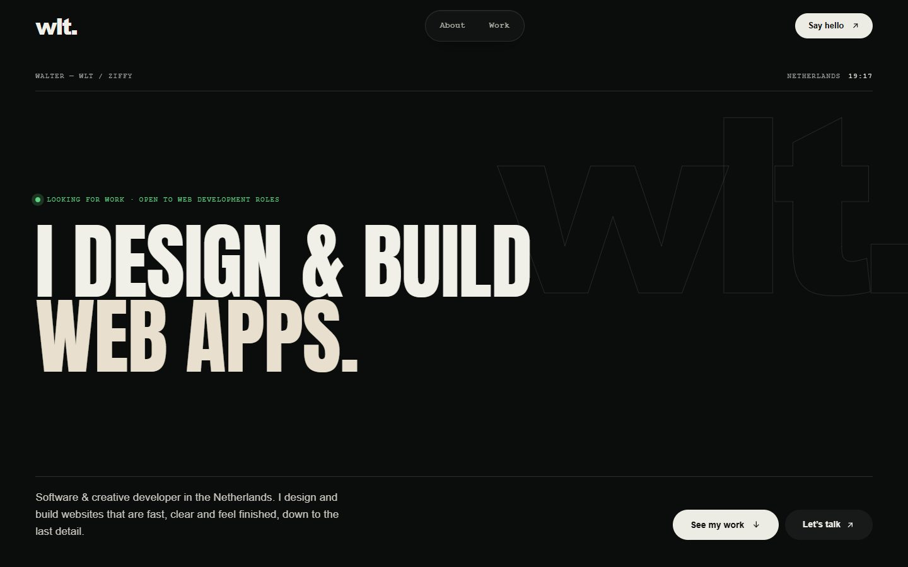
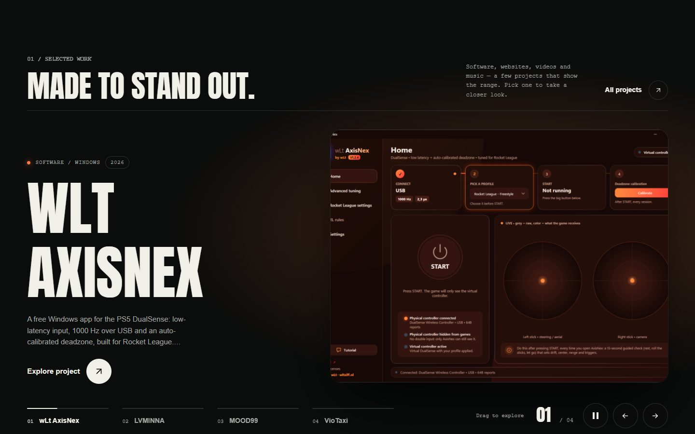
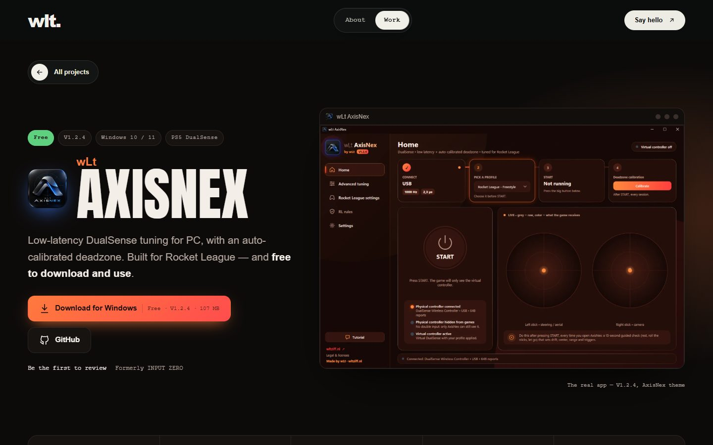
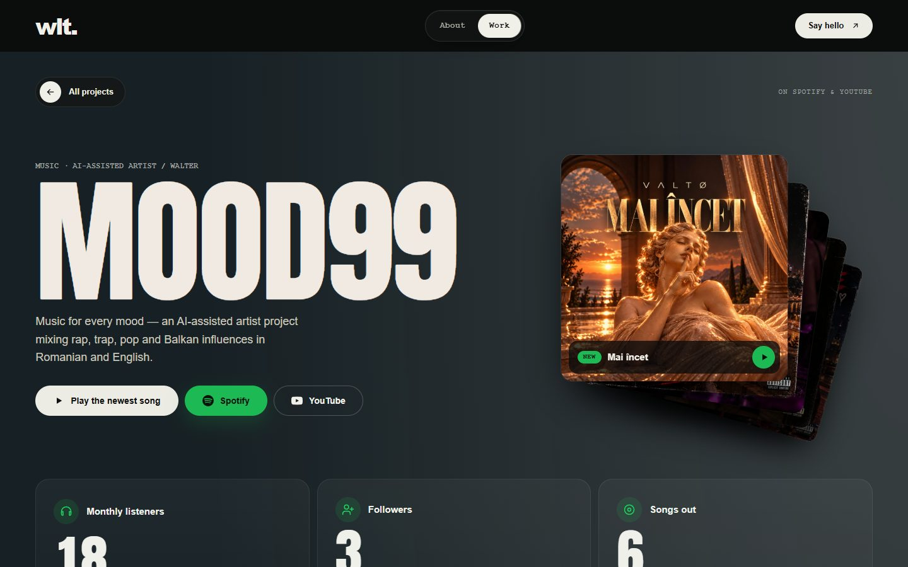
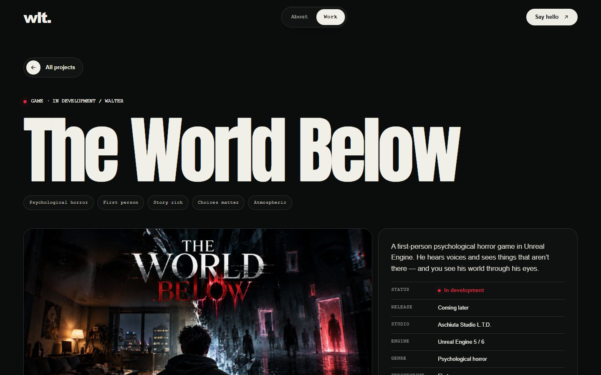
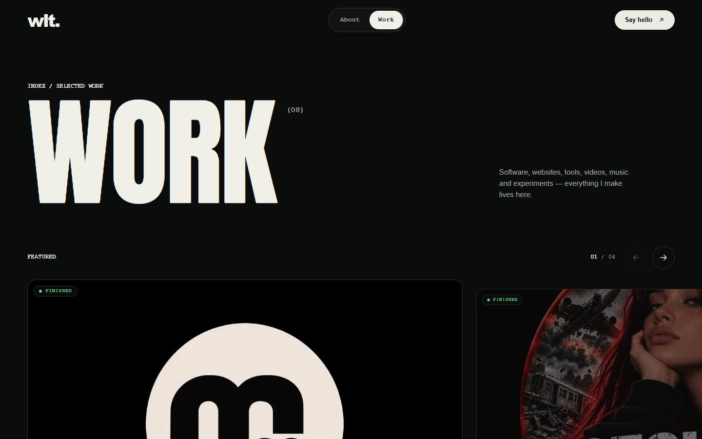
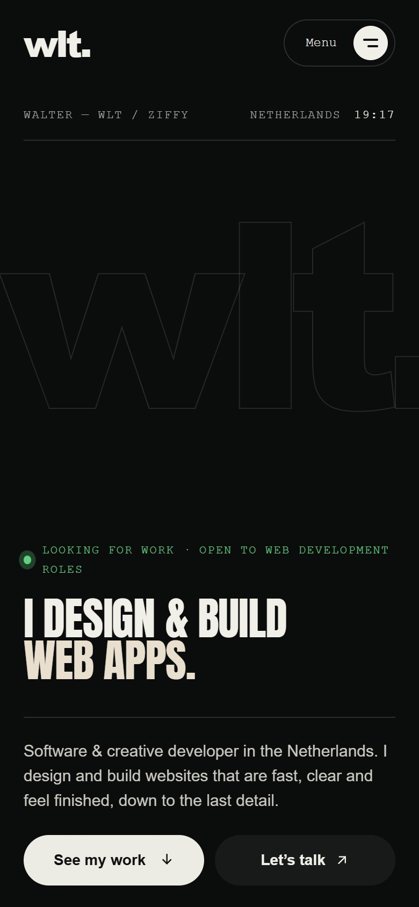
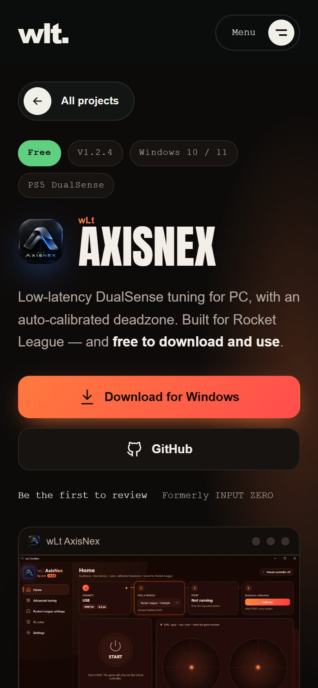

# wltziff.nl — how I built my portfolio

**Live site: [wltziff.nl](https://wltziff.nl)** · Walter (wLt), software & creative developer in the Netherlands

This repository explains how my portfolio website was made: the idea, the design, the technical choices and a few
pieces of the real code. The full source is kept private; the [`snippets/`](snippets) folder contains real excerpts.



---

## In short

- A **custom WordPress theme, written from scratch** (no page builder and no bought theme), plus a small
  **companion plugin** that owns the portfolio data. If the theme ever changes, the projects stay.
- **PHP 8, vanilla JavaScript, Tailwind CSS 4.** No front-end framework: the site sends only what each page needs.
- **Every project gets a page that fits it**: a store-style page for a game, a studio page, an artist page for
  music, a product page for software, and pages in each client's own look for websites.
- **Live data** from the Spotify Web API, the GitHub API (releases and recent activity) and the site's own
  analytics, cached on the server so the pages stay fast.
- **Fast, measured**: on the homepage, LCP 0.33 s, CLS 0 and INP 16 ms in a local Chrome DevTools run (Google's
  "good" limits are 2.5 s, 0.1 and 200 ms).
- **Privacy first**: first-party analytics only after cookie consent, no IP addresses stored, and YouTube/Spotify
  embeds that load nothing until you press play.

## What's new (October 2026)

- **AxisNex page, rebuilt for V1.2.5.** The app is now simply "AxisNex", so the page follows its wording: a
  controller tool, with product and game names only where they describe compatibility. A red **"not affiliated"
  notice** sits right under the title and again at the end. The page reads like a short guide: an **"On this page"**
  row and numbered sections, from what it does to how it works under the hood.
- **A 50-second promo video** on the AxisNex page, in a phone frame, with **chapters** you can click to jump to a
  part. In full screen it stays 9:16, never cropped. It loads nothing until you press play.
- **Page views from my own analytics** on the AxisNex page and on its project card. Old addresses count too
  (INPUT ZERO → AxisNex), and the number updates even on a cached copy of the page.
- **"Most viewed" carousel** on the Projects page, ranked by real visitors from the same analytics.
- **"Now" on the homepage**: my latest public work on GitHub (releases, updates and new projects), right under the hero.
- **"After hours"** on the homepage: MOOD99, my music, with live Spotify numbers.
- **The analytics dashboard, in plain words**: an "In short" sentence at the top, every number explained, deleted
  pages left out and renamed pages merged. More in [wltziff-analytics](https://github.com/wlt1920/wltziff-analytics).
- **Fewer, better projects**: the YouTube channels (Secunda Fatală, Moodanele) were removed from the site;
  LVMINNA, VioTaxi, StemVrij, KroneeQ and wltziff Analytics each have their own page.

## The design



The site is about range: websites, software, a horror game, a game studio and music. The design had to hold all
of that without looking like five different sites, so the base stays the same and each project adds its own colour.

- **Dark and editorial.** Large condensed headings (Anton), a monospace font for labels and metadata, and lots of
  space. The type does the work, so there's very little decoration.
- **One accent per project.** Each project has an accent colour that tints its page and its slide in the homepage
  carousel. MOOD99 uses Spotify green, AxisNex the orange of the app, StemVrij violet, VioTaxi taxi yellow and
  LVMINNA candle gold.
- **Motion with a purpose.** Headlines come in letter by letter, sections rise in as you scroll, and the carousel
  slides have depth. Every animation uses transform and opacity only (see [Performance](#performance)), and
  `prefers-reduced-motion` turns all of it off.
- **Mobile first.** Every layout is designed for a 390 px phone screen too, not just shrunk down to fit.

| Software product page | Music artist page | Game page |
|---|---|---|
|  |  |  |

| Projects index | Mobile: homepage | Mobile: product page |
|---|---|---|
|  |  |  |

> Screenshots from 3 October 2026. The AxisNex page has been redesigned since (see [What's new](#whats-new-october-2026)).

## How it's built

```text
WordPress (PHP 8)
├── Companion plugin "WLT Projects"   custom post type for projects, categories, project fields (portable data)
└── Theme "WLT"
    ├── front-page.php                hero, "Now" from GitHub, selected work, "After hours", marquee
    ├── single-wlt_project.php        picks the presentation: web / video / music / game, or a custom page
    ├── inc/
    │   ├── axisnex.php               software product page (live GitHub release, promo video, page views)
    │   ├── reviews.php               reviews without accounts, with anti-spam
    │   ├── mood99.php, spotify.php   artist page with live Spotify data
    │   ├── youtube.php               homepage "After hours" (MOOD99, live numbers)
    │   ├── github.php                homepage "Now": latest releases, updates and new projects
    │   ├── game.php, kroneeq.php     store-style game page and the studio page
    │   ├── lvminna.php, viotaxi.php,
    │   │   stemvrij.php              project pages in each brand's own look
    │   ├── analytics.php             first-party analytics (consent only), page views, "most viewed"
    │   ├── analytics-page.php        the wltziff Analytics project page
    │   └── seo.php                   structured data and sitemap extras
    ├── assets/tailwind/site.css      source styles (Tailwind CSS 4), compiled into assets/css/main.css
    └── assets/js/main.js             all page behaviour, one file, no framework
```

- **Page transitions** with [Swup](https://swup.js.org): links swap only the content, so moving between pages feels
  like an app. Every feature has a matching cleanup, so nothing keeps running after you leave a page.
- **Carousels** with [Swiper](https://swiperjs.com), loaded only on pages that have one.
- **Build**: Tailwind's standalone compiler (its SHA-256 is checked before it runs), terser for the JavaScript, and a
  small Puppeteer script that extracts the homepage's critical CSS.
- **Hosting**: Hostinger with the LiteSpeed page cache. Pages with live numbers are cached for 15 minutes, the
  site's own API answers are never cached, and a new review clears its page from the cache right away.

## Features worth a look

### Reviews without accounts — and without spam
On the [AxisNex page](https://wltziff.nl/projects/axisnex/) anyone can leave a star rating, a name and a short
review. There is no sign-up, so the anti-spam has to work without one:

- **One review per person**: a salted hash of the IP address *and* a random token kept in the browser. If either one
  has posted before, the review is refused. The raw IP address is never stored.
- **Bots**: a hidden honeypot field, a minimum time spent on the form, no links allowed, and length limits.
- **Floods**: at most 30 new reviews per hour for the whole site, even if they come from many different addresses.
- Reviews are saved as WordPress comments of their own type, so they can be moderated in the normal admin.

→ [`snippets/02-reviews-no-account-anti-spam.php`](snippets/02-reviews-no-account-anti-spam.php)

### Live data, cached carefully
The MOOD99 page lists every release as soon as it's out on Spotify. The AxisNex page always shows the newest
version, installer size and SHA-256 from GitHub, and its download button always points at the newest installer,
even on a cached copy of the page. The homepage's "Now" follows my GitHub activity. Each source is cached on the
server and each has a fallback, so a slow API never slows the page down.

→ [`snippets/06-live-github-release.php`](snippets/06-live-github-release.php),
[`snippets/07-spotify-api-cache.php`](snippets/07-spotify-api-cache.php)

### Privacy-first embeds
YouTube and Spotify players are shown as a poster with a play button. Nothing loads from YouTube or Spotify (no
cookies, no IP address sent) until the visitor presses play, and then YouTube loads from its no-cookie domain.

→ [`snippets/03-privacy-first-embeds.php`](snippets/03-privacy-first-embeds.php)

## Performance

I made every choice below after measuring with Chrome's performance tools, including on a CPU slowed down six times
and on emulated phones:

- **Native scrolling.** A JavaScript smooth-scroll library moved every scroll frame onto the main thread. Without
  it, scrolling runs on the browser's compositor and stays smooth even while scripts are busy.
- **Compositor-only animation.** Animations change only `transform` and `opacity`. The letter-by-letter hero uses
  the Web Animations API, so JavaScript only starts the animations and the GPU runs them.
  → [`snippets/01-hero-letter-animation.js`](snippets/01-hero-letter-animation.js)
- **No backdrop blur and no masks on large animated layers.** A blur behind a fixed bar has to be redrawn on every
  scroll frame, which phones struggle with. Glass effects use solid, slightly transparent backgrounds instead.
- **Animations pause off screen.** Looping animations (pulsing dots, equalisers) stop while their section isn't
  visible. → [`snippets/05-scroll-reveal-and-offscreen-pause.js`](snippets/05-scroll-reveal-and-offscreen-pause.js)
- **Critical CSS on the homepage.** The first screen's CSS is inlined and the full stylesheet loads without
  blocking the first paint. → [`snippets/04-critical-css.php`](snippets/04-critical-css.php)
- **Light pages**: WordPress' unused block styles are removed, scripts are deferred, images are lazy-loaded with
  explicit sizes (no layout shift), and the main hero image and font are preloaded.

## Accessibility

- `prefers-reduced-motion` is respected everywhere.
- Headings animated letter by letter also contain the full sentence for screen readers.
- Keyboard focus is always visible, and the carousels work with arrow keys.
- Text colours are chosen for WCAG AA contrast on the dark background.

## Snippets

| File | What it shows |
|---|---|
| [`01-hero-letter-animation.*`](snippets) | Letter-by-letter headline: PHP markup, CSS intro and compositor-only rotation in JS |
| [`02-reviews-no-account-anti-spam.php`](snippets/02-reviews-no-account-anti-spam.php) | REST API for reviews, one per person, anti-spam |
| [`03-privacy-first-embeds.php`](snippets/03-privacy-first-embeds.php) | Click-to-load YouTube/Spotify with cached oEmbed |
| [`04-critical-css.php`](snippets/04-critical-css.php) | Inlined critical CSS with a non-blocking full stylesheet |
| [`05-scroll-reveal-and-offscreen-pause.js`](snippets/05-scroll-reveal-and-offscreen-pause.js) | Scroll reveal and pausing animations off screen |
| [`06-live-github-release.php`](snippets/06-live-github-release.php) | Newest release from the GitHub API, cached, with a fallback |
| [`07-spotify-api-cache.php`](snippets/07-spotify-api-cache.php) | Spotify Web API (Client Credentials) with a cached token |

---

**Contact**: [wltziff.nl](https://wltziff.nl) · [LinkedIn](https://www.linkedin.com/in/walter-argint-636b53263/) ·
wltcollabs@gmail.com

© 2026 Walter (wLt). The code excerpts are shown for reference; please don't reuse them without asking.
